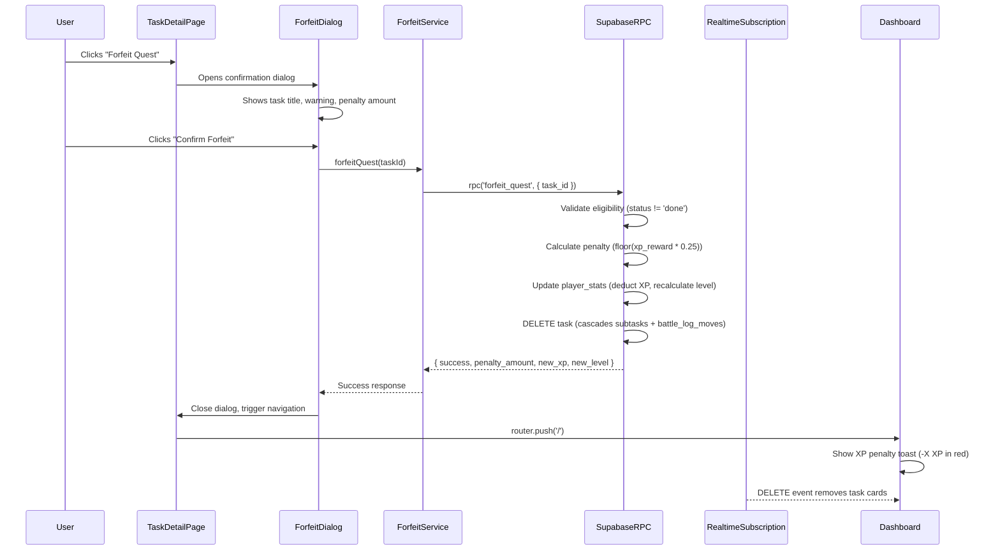
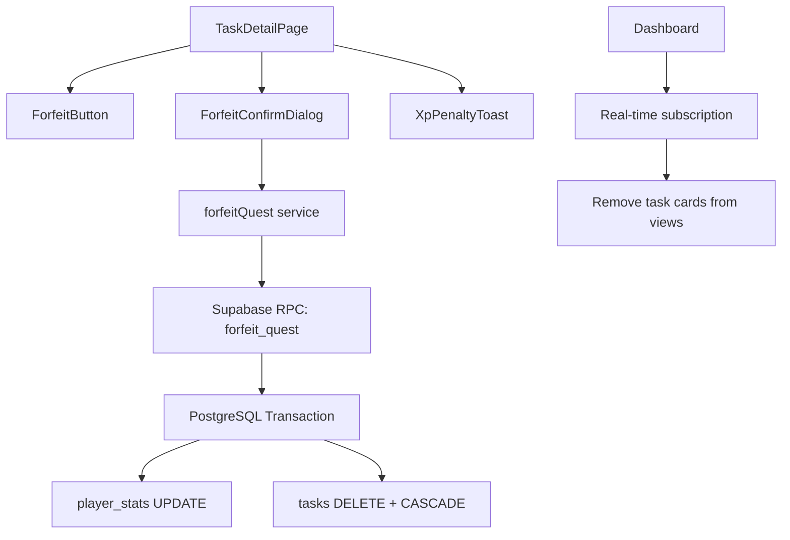

# Design Document: Forfeit Quest

## Overview

The Forfeit Quest feature provides a permanent deletion mechanism for incorrectly-entered quests, themed as "forfeiting" in the RPG context. It implements a multi-step safety flow: eligibility check → confirmation dialog → atomic deletion with XP penalty → real-time UI update and navigation.

The feature integrates with the existing task detail page (`/tasks/[id]`), player stats system, real-time subscriptions, and XP toast notifications. The deletion is atomic — the task, all nested subtasks, all battle log moves, and the XP penalty are processed in a single database transaction to prevent partial state.

### Key Design Decisions

1. **Database-level cascade for subtasks**: The existing `ON DELETE CASCADE` foreign key on `tasks.parent_task_id` handles recursive subtask deletion automatically. Battle log moves also cascade via `ON DELETE CASCADE` on `battle_log_moves.task_id`.
2. **RPC function for atomicity**: A Supabase PostgreSQL function (`forfeit_quest`) wraps the eligibility check, XP penalty calculation, player stats update, and task deletion in a single transaction.
3. **Client-side eligibility gating + server-side enforcement**: The UI disables the forfeit button for ineligible tasks, but the RPC function independently validates eligibility to prevent bypasses.
4. **Reuse existing XpToast with negative styling**: A new variant of the existing `XpToast` component displays the penalty in red instead of gold.

## Architecture



### Component Architecture



## Components and Interfaces

### New Components

#### `ForfeitButton`
- **Location**: `components/ForfeitButton.tsx`
- **Type**: Client component (`'use client'`)
- **Props**: `{ taskId: string; taskStatus: Status; isSubtask: boolean; xpReward: number; onForfeit: () => void }`
- **Responsibility**: Renders the forfeit button with eligibility logic (disabled when `status === 'done'` or `isSubtask === true`), hover glow effect, tooltip for disabled states.

#### `ForfeitConfirmDialog`
- **Location**: `components/ForfeitConfirmDialog.tsx`
- **Type**: Client component (`'use client'`)
- **Props**: `{ isOpen: boolean; taskTitle: string; penaltyAmount: number; onConfirm: () => Promise<void>; onCancel: () => void }`
- **Responsibility**: Modal overlay with task title (truncated at 50 chars), warning text, penalty display, confirm/cancel buttons, loading state, timeout handling (15s), error display.
- **Accessibility**: Focus trap, Escape key handler, `role="alertdialog"`, `aria-labelledby`, `aria-describedby`.

#### `XpPenaltyToast`
- **Location**: `components/XpPenaltyToast.tsx`
- **Type**: Client component (`'use client'`)
- **Props**: `{ amount: number; onDismiss: () => void }`
- **Responsibility**: Displays "-X XP" in red pixel font for 3 seconds. Mirrors `XpToast` structure but with red color scheme and skull emoji.

### Modified Components

#### `TaskDetailPage` (`app/tasks/[id]/page.tsx`)
- Add `ForfeitButton` below the complete button with 16px spacing
- Add `ForfeitConfirmDialog` state management
- Add forfeit handler that calls the service, navigates to `/`, and passes penalty info via URL search params or sessionStorage for the toast

#### `Dashboard` (`app/page.tsx`)
- Check for pending forfeit penalty notification on mount (via sessionStorage)
- Display `XpPenaltyToast` if penalty data exists
- Clear sessionStorage after displaying

### New Service Function

#### `lib/services/forfeit.ts`

```typescript
export interface ForfeitResult {
  success: boolean;
  penaltyAmount: number;
  newXp: number;
  newLevel: number;
  previousLevel: number;
}

/**
 * Forfeit (permanently delete) a quest with XP penalty.
 * Calls the forfeit_quest RPC which handles eligibility, penalty, and deletion atomically.
 */
export async function forfeitQuest(taskId: string): Promise<ForfeitResult>;
```

### New Database Function

#### `forfeit_quest` RPC

```sql
CREATE OR REPLACE FUNCTION forfeit_quest(p_task_id UUID)
RETURNS JSONB
LANGUAGE plpgsql
SECURITY DEFINER
AS $$
DECLARE
  v_task RECORD;
  v_stats RECORD;
  v_penalty INTEGER;
  v_new_xp INTEGER;
  v_new_level INTEGER;
  v_previous_level INTEGER;
BEGIN
  -- 1. Fetch task and validate ownership + eligibility
  -- 2. Calculate penalty: floor(xp_reward * 0.25)
  -- 3. Fetch player_stats, calculate new XP (floor at 0)
  -- 4. Recalculate level from new XP
  -- 5. Update player_stats
  -- 6. Delete task (cascades subtasks + battle_log_moves)
  -- 7. Return result JSON
END;
$$;
```

## Data Models

### Existing Tables (No Schema Changes Required)

The existing schema already supports the forfeit feature:

| Table | Relevant Columns | Cascade Behavior |
|-------|-----------------|------------------|
| `tasks` | `id`, `status`, `xp_reward`, `parent_task_id`, `user_id` | `parent_task_id REFERENCES tasks(id) ON DELETE CASCADE` — recursive subtask deletion |
| `battle_log_moves` | `id`, `task_id`, `user_id` | `task_id REFERENCES tasks(id) ON DELETE CASCADE` — moves deleted with task |
| `player_stats` | `id`, `user_id`, `xp`, `level` | Updated atomically in the RPC |

### New Database Migration (`005_forfeit_quest.sql`)

Adds the `forfeit_quest` RPC function. No table changes needed.

### Data Flow

1. **Input**: `task_id` (UUID)
2. **Validation**: Task exists, belongs to `auth.uid()`, status ≠ `'done'`, `parent_task_id IS NULL`
3. **Penalty Calculation**: `floor(xp_reward * 0.25)`
4. **XP Update**: `max(0, current_xp - penalty)`
5. **Level Recalculation**: Iterative threshold subtraction (level N threshold = N × 100)
6. **Deletion**: `DELETE FROM tasks WHERE id = p_task_id` (cascades handle the rest)
7. **Output**: `{ success, penalty_amount, new_xp, new_level, previous_level }`

### Forfeit Penalty Toast Data Transfer

To display the XP penalty toast on the dashboard after navigation, the penalty data is stored in `sessionStorage`:

```typescript
interface ForfeitPenaltyData {
  penaltyAmount: number;
  timestamp: number; // prevent stale toasts
}
// Key: 'forfeit_penalty'
```

## Correctness Properties

*A property is a characteristic or behavior that should hold true across all valid executions of a system — essentially, a formal statement about what the system should do. Properties serve as the bridge between human-readable specifications and machine-verifiable correctness guarantees.*

### Property 1: Forfeit eligibility is determined by status and parentage

*For any* task, the forfeit action should be enabled if and only if the task status is not "done" AND the task has a null `parent_task_id`. A task with status "done" or a non-null `parent_task_id` should never have the forfeit action available.

**Validates: Requirements 2.1, 2.2, 2.3**

### Property 2: Server-side forfeit rejection for completed tasks

*For any* task with status "done", calling the `forfeit_quest` function should return an error and leave the task and player stats completely unchanged in the database.

**Validates: Requirements 2.4**

### Property 3: XP penalty calculation with zero floor

*For any* non-negative integer `xp_reward` and any non-negative integer `current_xp`, the resulting XP after forfeit penalty should equal `max(0, current_xp - floor(xp_reward * 0.25))`. The result must never be negative.

**Validates: Requirements 3.1, 3.2**

### Property 4: Level recalculation consistency after XP decrease

*For any* non-negative integer `total_xp`, the `calculateLevel` function should produce a level L such that the sum of thresholds for levels 1 through L-1 is ≤ `total_xp`, and the sum of thresholds for levels 1 through L exceeds `total_xp`. This must hold for XP values that result from penalty deductions (i.e., level can decrease).

**Validates: Requirements 3.3**

### Property 5: Title truncation preserves content within limit

*For any* string, if its length exceeds 50 characters, the truncated result should be exactly the first 50 characters followed by "…". If its length is 50 or fewer characters, the result should be the original string unchanged.

**Validates: Requirements 5.1**

## Error Handling

### Service Layer Errors

| Error Condition | Handling | User Feedback |
|----------------|----------|---------------|
| Task not found (invalid UUID or deleted) | Service throws `Error` | Dialog shows "Quest not found" message |
| Task status is "done" (server-side check) | RPC returns error JSON | Dialog shows "Completed quests cannot be forfeited" |
| Task is a subtask (server-side check) | RPC returns error JSON | Dialog shows "Subtasks can only be forfeited from the parent quest" |
| Database connection failure | Service throws `Error` | Dialog shows "Could not connect to the quest board. Please try again." |
| RPC timeout (>15 seconds) | Client-side AbortController | Dialog shows "Operation timed out. Please try again." and re-enables buttons |
| Concurrent deletion (task deleted by another session) | RPC returns not-found | Dialog shows "This quest has already been removed." |

### XP Penalty Edge Cases

| Scenario | Behavior |
|----------|----------|
| `xp_reward = 0` | Penalty = 0, no XP deducted |
| `xp_reward = 1` | Penalty = floor(0.25) = 0, no XP deducted |
| `xp_reward = 4` | Penalty = floor(1.0) = 1 |
| Penalty > current XP | XP set to 0, level recalculated from 0 |
| Player at level 1 with 0 XP | Penalty applied, XP stays at 0, level stays at 1 |

### Real-Time Subscription Errors

| Scenario | Behavior |
|----------|----------|
| Subscription disconnected during forfeit | Task removed on reconnection re-fetch |
| Multiple clients viewing same task | All clients receive DELETE event and remove cards |
| Stale sessionStorage penalty data (>30s old) | Ignored on dashboard mount |

## Testing Strategy

### Property-Based Tests (`__tests__/properties/forfeit-quest.test.ts`)

Using `fast-check` with minimum 100 iterations per property:

1. **Forfeit eligibility property**: Generate random tasks with varying statuses and parent_task_id values. Assert eligibility function returns correct boolean.
2. **Server-side rejection property**: Generate tasks with status "done" and various xp_reward values. Assert the forfeit logic rejects them.
3. **XP penalty calculation property**: Generate random `(xp_reward, current_xp)` pairs. Assert result equals `max(0, current_xp - floor(xp_reward * 0.25))`.
4. **Level recalculation property**: Generate random non-negative XP values (including post-penalty values). Assert `calculateLevel` produces a level consistent with the iterative threshold formula.
5. **Title truncation property**: Generate random strings of varying lengths. Assert truncation behavior matches the 50-char rule.

**Configuration:**
- Library: `fast-check`
- Iterations: 100 minimum per property
- Tag format: `Feature: forfeit-quest, Property {N}: {description}`

### Unit Tests (`__tests__/unit/forfeit-quest.test.ts`)

- Dialog opens when forfeit button is clicked
- Dialog closes on Cancel click and Escape key
- Buttons disabled during processing (loading state)
- Error message displayed on failure
- Navigation to `/` on success
- XP penalty toast displayed with correct format
- Forfeit button not rendered on Kanban/Folder views
- Forfeit button has correct accessible label
- Tooltip shown for disabled states

### Integration Tests

- Full forfeit flow: create task → forfeit → verify task deleted
- Cascade deletion: create task with subtasks and battle log moves → forfeit → verify all deleted
- Pending XP not awarded: create task with pending XP → forfeit → verify player XP only decreased by penalty
- Real-time subscription receives DELETE events after forfeit
- Concurrent access: two sessions, one forfeits, other sees removal

