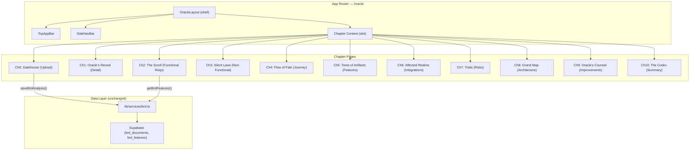
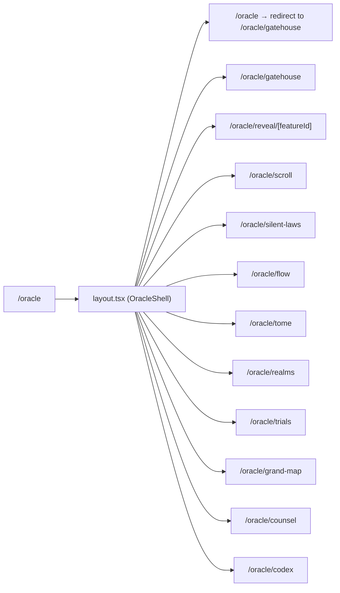

# Design Document: Oracle Redesign — Tactical Command Interface

## Overview

The Oracle Redesign transforms the existing single-page BRD analysis view (`/oracle`) into a multi-chapter, immersive "Tactical Command Interface" with a dark-gold design system inspired by a Stitch export. The redesign introduces 11 distinct chapter pages under a unified shell layout (TopAppBar + SideNav), each presenting a different facet of the BRD analysis: upload, requirements, flows, risks, architecture, and synthesis.

The design coexists with the existing RPG Quest Board theme — it introduces its own Tailwind theme extension (`oracle-*` tokens) and isolated layout components. The existing BRD data layer (`lib/services/brd.ts`) and Supabase schema remain unchanged; only the presentation layer is rebuilt.

## Architecture



## Routing Structure



## Components and Interfaces

### Component 1: OracleLayout (Shell)

**Purpose**: Wraps all Oracle chapter pages with the TopAppBar, SideNavBar, and content area. Manages active document context.

**Interface**:
```typescript
// app/oracle/layout.tsx
interface OracleLayoutProps {
  children: React.ReactNode;
}

// Context provided to all chapter pages
interface OracleContext {
  activeDocument: BrdDocument | null;
  features: BrdFeature[];
  extras: AnalysisExtras;
  isAnalyzing: boolean;
  setActiveDocument: (doc: BrdDocument) => void;
}
```

**Responsibilities**:
- Render TopAppBar and SideNavBar
- Provide OracleContext to child pages
- Manage active BRD document state
- Handle responsive layout (collapse SideNav on mobile)

### Component 2: TopAppBar

**Purpose**: Fixed 64px navigation bar with chapter rail, document title, and action buttons.

**Interface**:
```typescript
interface TopAppBarProps {
  documentTitle: string | null;
  activeChapter: ChapterSlug;
  chapters: ChapterMeta[];
  onChapterSelect: (slug: ChapterSlug) => void;
}

type ChapterSlug =
  | 'gatehouse' | 'reveal' | 'scroll' | 'silent-laws'
  | 'flow' | 'tome' | 'realms' | 'trials'
  | 'grand-map' | 'counsel' | 'codex';

interface ChapterMeta {
  slug: ChapterSlug;
  label: string;
  icon: string; // Material Symbols name
  number: number;
}
```

**Responsibilities**:
- Display horizontal chapter navigation rail (scrollable on mobile)
- Highlight active chapter with gold pill indicator
- Show document title and status badge
- Backdrop blur with gold border-bottom

### Component 3: SideNavBar

**Purpose**: 256px fixed left sidebar with avatar, chapter links, and "TRANSCRIBE BRD" action button.

**Interface**:
```typescript
interface SideNavBarProps {
  activeChapter: ChapterSlug;
  documentTitle: string | null;
  analysisStatus: BrdDocument['analysis_status'] | null;
  onNewAnalysis: () => void;
}
```

**Responsibilities**:
- Display user avatar and document info
- Render chapter links with left-border accent on active
- Show "TRANSCRIBE BRD" button (gold primary)
- Collapse to hamburger on mobile (< 1024px)
- Show analysis progress indicator when analyzing

### Component 4: RequirementCard

**Purpose**: Card component for displaying individual BRD requirements with priority badge and user action/system reaction split.

**Interface**:
```typescript
interface RequirementCardProps {
  feature: BrdFeature;
  index: number;
  variant: 'compact' | 'expanded';
  onSelect?: (featureId: string) => void;
}
```

**Responsibilities**:
- Display requirement ID, name, priority badge
- Show "Aksi User" / "Reaksi Sistem" split panel in expanded variant
- Gold border glow on hover
- Flip-in animation on mount

### Component 5: RiskCard

**Purpose**: Risk analysis card with severity-colored left border and mitigation protocol.

**Interface**:
```typescript
interface RiskCardProps {
  risk: RiskItem;
  index: number;
}

// From existing lib/brd/prompt.ts
interface RiskItem {
  risk: string;
  impact: 'critical' | 'high' | 'medium' | 'low';
  mitigation: string;
  category?: string;
}
```

**Responsibilities**:
- Left border colored by severity (critical=red, high=orange, medium=yellow, low=green)
- Display risk description, impact badge, mitigation text
- Masonry-compatible sizing

### Component 6: FlowStepper

**Purpose**: Vertical timeline visualization for user journey/flow process.

**Interface**:
```typescript
interface FlowStepperProps {
  steps: FlowStep[];
  activeStepId?: string;
  onStepSelect?: (stepId: string) => void;
}

interface FlowStep {
  id: string;
  actor: string;
  action: string;
  type: 'start' | 'process' | 'decision' | 'end';
}
```

**Responsibilities**:
- Render vertical timeline with gold thread connector
- Expand active step to show full content
- Collapse inactive steps to single-line summary
- Animate step transitions

### Component 7: IntegrationCard

**Purpose**: System dependency card showing impacted systems.

**Interface**:
```typescript
interface IntegrationCardProps {
  system: ImpactedSystem;
  index: number;
}

interface ImpactedSystem {
  system_name: string;
  description: string;
  impact_type: string;
}
```

**Responsibilities**:
- Display system icon, name, type badge
- Show impact description
- Grid-compatible layout

### Component 8: ArchitectureCanvas

**Purpose**: Interactive pannable/zoomable canvas for architecture diagrams.

**Interface**:
```typescript
interface ArchitectureCanvasProps {
  diagramCode: string; // Mermaid syntax
  onNodeClick?: (nodeId: string) => void;
}
```

**Responsibilities**:
- Render Mermaid diagram with pan/zoom controls
- Apply Oracle theme styling to diagram nodes
- Touch-friendly gesture support
- Fullscreen toggle

### Component 9: ScoreOrb

**Purpose**: Animated circular score indicator for the Codex summary page.

**Interface**:
```typescript
interface ScoreOrbProps {
  score: number; // 0-100
  label: string;
  size?: 'sm' | 'md' | 'lg';
}
```

**Responsibilities**:
- Animated fill on mount (gold gradient)
- Pulsing glow effect
- Display numeric score and label

### Component 10: ParticleBackground

**Purpose**: Animated particle effect for the Gatehouse landing page.

**Interface**:
```typescript
interface ParticleBackgroundProps {
  density?: number;
  color?: string;
  speed?: number;
}
```

**Responsibilities**:
- Canvas-based particle animation
- Respect `prefers-reduced-motion`
- Low CPU usage (requestAnimationFrame with throttle)
- Gold-tinted floating particles

## Data Models

### Existing Models (unchanged)

The redesign uses the existing `BrdDocument` and `BrdFeature` interfaces from `lib/types.ts` without modification. The data layer (`lib/services/brd.ts`) remains the same.

### New UI-Only Types

```typescript
// lib/oracle/types.ts

export type ChapterSlug =
  | 'gatehouse' | 'reveal' | 'scroll' | 'silent-laws'
  | 'flow' | 'tome' | 'realms' | 'trials'
  | 'grand-map' | 'counsel' | 'codex';

export interface ChapterMeta {
  slug: ChapterSlug;
  label: string;
  icon: string;
  number: number;
  description: string;
}

export const CHAPTERS: ChapterMeta[] = [
  { slug: 'gatehouse', label: 'The Gatehouse', icon: 'upload_file', number: 0, description: 'Upload & entry' },
  { slug: 'reveal', label: "Oracle's Reveal", icon: 'visibility', number: 1, description: 'Requirement detail' },
  { slug: 'scroll', label: 'The Scroll', icon: 'description', number: 2, description: 'Functional requirements' },
  { slug: 'silent-laws', label: 'Silent Laws', icon: 'shield', number: 3, description: 'Non-functional requirements' },
  { slug: 'flow', label: 'Flow of Fate', icon: 'route', number: 4, description: 'User journey' },
  { slug: 'tome', label: 'Tome of Artifacts', icon: 'auto_stories', number: 5, description: 'Feature cards' },
  { slug: 'realms', label: 'Affected Realms', icon: 'hub', number: 6, description: 'System dependencies' },
  { slug: 'trials', label: 'Trials & Tribulations', icon: 'warning', number: 7, description: 'Risk analysis' },
  { slug: 'grand-map', label: 'The Grand Map', icon: 'map', number: 8, description: 'Architecture diagram' },
  { slug: 'counsel', label: "Oracle's Counsel", icon: 'lightbulb', number: 9, description: 'Improvements' },
  { slug: 'codex', label: 'The Codex', icon: 'summarize', number: 10, description: 'Summary & synthesis' },
];

export interface OracleThemeTokens {
  surface: string;
  deepest: string;
  primaryGold: string;
  primaryContainer: string;
  primaryFixed: string;
  secondarySapphire: string;
  secondaryContainer: string;
  stone: string;
  card: string;
  panel: string;
  container: string;
  textOnSurface: string;
  textMuted: string;
  textFaint: string;
  borderGold: string;
  severityCritical: string;
  severityHigh: string;
  severityMedium: string;
  severityLow: string;
}

// Analysis extras (typed version of existing unknown[] fields)
export interface AnalysisExtras {
  flow_process: FlowStep[];
  improvements: ImprovementItem[];
  questions: QuestionItem[];
  risk_analysis: RiskItem[];
  architecture_diagram: string;
  impacted_systems: ImpactedSystem[];
  fsd_design: FsdDesignItem[];
}

export interface ImprovementItem {
  title: string;
  description: string;
  category: string;
  priority: 'high' | 'medium' | 'low';
}

export interface QuestionItem {
  question: string;
  context: string;
  category: string;
  target_role: string;
  resolution?: string; // User-provided answer
}

export interface ImpactedSystem {
  system_name: string;
  description: string;
  impact_type: string;
}

export interface FsdDesignItem {
  feature_name: string;
  explanation: string;
  user_action: string;
  system_reaction: string;
}
```

### Design System Tokens (Tailwind Extension)

```typescript
// tailwind.config.ts — oracle theme extension
const oracleTheme = {
  colors: {
    'oracle-surface': '#141311',
    'oracle-deepest': '#0e0d0b',
    'oracle-gold': '#ecc14f',
    'oracle-gold-container': '#c8a030',
    'oracle-gold-fixed': '#ffdf95',
    'oracle-sapphire': '#92ccff',
    'oracle-sapphire-container': '#006ea6',
    'oracle-stone': '#141210',
    'oracle-card': '#1a1815',
    'oracle-panel': '#201e1a',
    'oracle-container': '#211f1d',
    'oracle-text': '#e6e2de',
    'oracle-muted': '#9a9080',
    'oracle-faint': '#5a5248',
    'oracle-border': 'rgba(200, 169, 110, 0.18)',
    'oracle-critical': '#e74c3c',
    'oracle-high': '#e67e22',
    'oracle-medium': '#f39c12',
    'oracle-low': '#27ae60',
  },
  fontFamily: {
    'oracle-display': ['Cinzel', 'serif'],
    'oracle-body': ['Inter', 'sans-serif'],
    'oracle-mono': ['JetBrains Mono', 'monospace'],
  },
  fontSize: {
    'oracle-hero': ['56px', { lineHeight: '1.1', fontWeight: '700' }],
    'oracle-headline-lg': ['32px', { lineHeight: '1.2', fontWeight: '600' }],
    'oracle-headline-md': ['20px', { lineHeight: '1.3', fontWeight: '600' }],
    'oracle-body-lg': ['18px', { lineHeight: '1.6' }],
    'oracle-body-md': ['16px', { lineHeight: '1.5' }],
    'oracle-label-mono': ['14px', { lineHeight: '1.4' }],
    'oracle-label-sm': ['12px', { lineHeight: '1.4' }],
  },
  boxShadow: {
    'oracle-glow': '0 0 15px rgba(236, 193, 79, 0.4)',
    'oracle-glow-sm': '0 0 8px rgba(236, 193, 79, 0.25)',
    'oracle-glow-lg': '0 0 30px rgba(236, 193, 79, 0.5)',
  },
};
```

## Error Handling

### Error Scenario 1: BRD Upload Failure

**Condition**: File parsing fails or API returns error during analysis
**Response**: Display error toast with descriptive message in Gatehouse page, preserve uploaded file reference for retry
**Recovery**: User can retry upload or paste text manually

### Error Scenario 2: Document Not Found

**Condition**: User navigates to a chapter page without an active document
**Response**: Redirect to Gatehouse with informational message
**Recovery**: User uploads a new document or selects from history

### Error Scenario 3: Analysis Timeout/Failure

**Condition**: Streaming analysis exceeds 10-minute threshold or connection drops
**Response**: Mark document as `failed`, show error state with option to re-analyze
**Recovery**: User clicks "Re-analyze" button or starts fresh

### Error Scenario 4: Empty State (No Data for Chapter)

**Condition**: A chapter has no data (e.g., no non-functional requirements found)
**Response**: Display themed empty state with hourglass animation and descriptive message
**Recovery**: Informational only — user can navigate to other chapters

## Testing Strategy

### Unit Testing Approach

- Test chapter navigation logic (active state, routing)
- Test data transformation functions (feature filtering, severity sorting)
- Test responsive breakpoint logic
- Test animation trigger conditions

### Property-Based Testing Approach

**Property Test Library**: fast-check

- Chapter navigation: For any valid chapter slug, navigation produces correct active state
- Feature filtering: For any set of features, functional/non-functional split is exhaustive and disjoint
- Risk sorting: For any risk array, severity sort produces correct ordering
- Theme token resolution: For any severity level, correct color token is returned

### Integration Testing Approach

- Test OracleContext provider with mock data
- Test SideNav collapse/expand on viewport changes
- Test document loading flow (Gatehouse → analysis → chapter navigation)

## Performance Considerations

- **Code splitting**: Each chapter page is a separate route segment (automatic Next.js code splitting)
- **Lazy loading**: ArchitectureCanvas (Mermaid) and ParticleBackground loaded via `next/dynamic` with `ssr: false`
- **Image optimization**: Material Symbols loaded as icon font (single request), not individual SVGs
- **Animation budget**: All animations respect `prefers-reduced-motion`; particle canvas throttled to 30fps
- **Virtual scrolling**: Long requirement lists (>50 items) use windowed rendering

## Security Considerations

- No new API routes or data mutations — reuses existing BRD service layer
- File upload validation (PDF/TXT only, max 10MB) already enforced by existing API
- All data access scoped by RLS (`auth.uid()`) — no changes needed
- CSP headers already configured for Supabase and Google Fonts origins

## Dependencies

| Dependency | Purpose | Status |
|-----------|---------|--------|
| `next/font` | Load Cinzel, Inter, JetBrains Mono | New fonts (existing mechanism) |
| Material Symbols | Icon font | New (loaded via `<link>` or `next/font`) |
| Tailwind CSS 3 | Styling with oracle theme tokens | Existing (extend config) |
| Mermaid | Architecture diagram rendering | Existing (MermaidDiagram component) |
| Supabase | Data layer | Existing (no changes) |
| Canvas API | Particle animation | Browser native |

## Correctness Properties

*A property is a characteristic or behavior that should hold true across all valid executions of a system — essentially, a formal statement about what the system should do. Properties serve as the bridge between human-readable specifications and machine-verifiable correctness guarantees.*

### Property 1: Feature partition is exhaustive and disjoint

*For any* array of BrdFeature objects, partitioning into functional and non-functional sets SHALL produce two disjoint sets whose union equals the original array (no feature is lost or duplicated).

**Validates: Requirements 4.1, 5.1**

### Property 2: Severity and step-type color mapping is total

*For any* valid Severity_Level ('critical' | 'high' | 'medium' | 'low') or step type ('start' | 'process' | 'decision' | 'end'), the color resolver SHALL return the correct non-empty color string as defined in the Oracle_Theme.

**Validates: Requirements 7.4, 8.2**

### Property 3: Chapter navigation produces correct URL and active state

*For any* valid ChapterSlug from the CHAPTERS constant, navigating to that chapter SHALL produce a URL matching `/oracle/{slug}` and set both the SideNavBar and TopAppBar active indicators to that slug.

**Validates: Requirements 2.1, 2.2, 2.4**

### Property 4: Risk sort is stable by severity

*For any* array of RiskItems, sorting by severity SHALL produce an array where all 'critical' items precede 'high', which precede 'medium', which precede 'low', and items within the same severity level maintain their original relative order (stable sort).

**Validates: Requirements 8.5**

### Property 5: Empty document guard redirect

*For any* ChapterSlug that is not 'gatehouse', if no Active_Document is set in Oracle_Context, the system SHALL redirect to `/oracle/gatehouse`.

**Validates: Requirements 2.3**

### Property 6: Requirement card renders all required fields

*For any* BrdFeature object, the rendered Requirement_Card SHALL contain the feature name, description, priority badge text, and (when present) the as_is and to_be content in the action/reaction split panels.

**Validates: Requirements 4.3, 4.4, 5.3, 6.2**

### Property 7: Risk card renders all required fields

*For any* RiskItem object, the rendered Risk_Card SHALL contain the severity badge, risk description text, and mitigation text.

**Validates: Requirements 8.4**

### Property 8: Severity filter produces correct subset

*For any* combination of selected severity filters and any risk_analysis array, the visible Risk_Cards SHALL be exactly those items whose severity level is included in the selected filter set.

**Validates: Requirements 8.3**

### Property 9: File validation rejects invalid uploads

*For any* file whose size exceeds 10MB or whose MIME type is not PDF or plain text, the upload handler SHALL reject the file and return a validation error without initiating analysis.

**Validates: Requirements 3.7**

### Property 10: Reduced motion disables animations

*For any* Oracle page, when `prefers-reduced-motion: reduce` is active, the rendered output SHALL not include animation classes (flip-in, fade-up, particle canvas) on any element.

**Validates: Requirements 15.3**

### Property 11: Codex chapter grid shows correct item counts

*For any* Active_Document with associated features and extras, the Codex chapter overview grid SHALL display the correct item count for each chapter (functional features count for Scroll, non-functional for Silent Laws, flow_process length for Flow, risk_analysis length for Trials, etc.).

**Validates: Requirements 13.2**

### Property 12: Oracle theme does not override RPG tokens

*For any* existing RPG theme token key (rpg-dark, rpg-card, rpg-border, font-pixel, font-retro, shadow-normal, etc.), the resolved Tailwind config after Oracle theme extension SHALL produce the same value as before the extension was added.

**Validates: Requirements 14.3**
