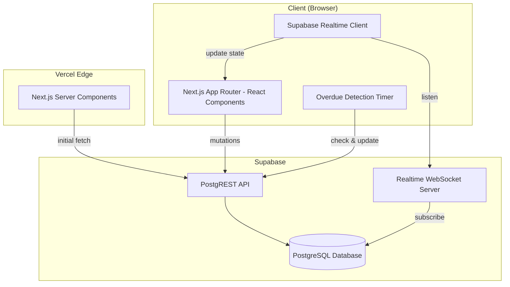
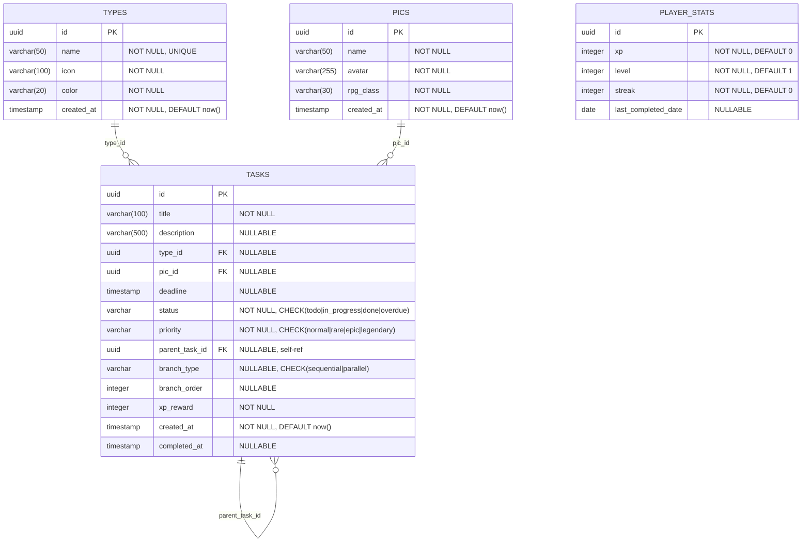

# Design Document: RPG Quest Board

## Overview

Quest Board is a full-stack gamified RPG-style to-do list application that transforms task management into an engaging retro pixel/8-bit RPG experience. The system is built as a Next.js 14 App Router application with Supabase as the backend (PostgreSQL database + real-time subscriptions), styled with Tailwind CSS and custom pixel-art theming, and deployed on Vercel.

The core domain maps traditional task management concepts to RPG terminology:
- Tasks → Quests
- Categories → Guilds (Types)
- Assignees → Party Members (PICs)
- Completion → XP rewards and leveling

### Key Design Decisions

1. **Next.js 14 App Router** — Leverages server components for initial data fetching, client components for interactivity, and file-based routing for clean URL structure.
2. **Supabase** — Provides PostgreSQL database, auto-generated REST API, and real-time WebSocket subscriptions without a custom backend.
3. **Single-player model** — No authentication; one player_stats record per deployment. Simplifies the architecture while delivering the full gamification experience.
4. **Client-side XP/level calculations** — XP award logic runs on the client after successful task completion mutations, then persists updated stats. This keeps the UX responsive (instant feedback via toasts/animations).
5. **Polling + Real-time hybrid for overdue detection** — A 60-second client-side interval checks for overdue tasks, complemented by Supabase real-time for cross-tab sync.

## Architecture



### Rendering Strategy

| Route | Rendering | Rationale |
|-------|-----------|-----------|
| `/` (Dashboard) | Client Component with `useEffect` fetch | Needs real-time updates, filters, sorting |
| `/tasks/[id]` | Server Component initial fetch + Client hydration | SEO-friendly detail page with interactive subtask tree |
| `/master/types` | Client Component | CRUD operations with immediate feedback |
| `/master/pics` | Client Component | CRUD operations with immediate feedback |

### Data Flow

1. **Initial Load**: Server components fetch data via Supabase client → render HTML → hydrate on client
2. **Mutations**: Client components call Supabase API directly → on success, update local state + trigger side effects (XP, animations)
3. **Real-time Sync**: Supabase channels push INSERT/UPDATE/DELETE events → client handlers update React state
4. **Overdue Detection**: `setInterval` every 60s queries tasks with `deadline < now AND status NOT IN ('done')` → batch update to "overdue"

## Components and Interfaces

### Page Components

```
app/
├── layout.tsx              # Root layout with fonts, scanline overlay, dark theme
├── page.tsx                # Dashboard (Quest Board)
├── tasks/
│   └── [id]/
│       └── page.tsx        # Task Detail + Subtask Tree
└── master/
    ├── page.tsx            # Master data navigation
    ├── types/
    │   └── page.tsx        # Type (Guild) management
    └── pics/
        └── page.tsx        # PIC (Party Member) management
```

### Core UI Components

| Component | Props | Responsibility |
|-----------|-------|----------------|
| `Sidebar` | `playerStats`, `activeRoute` | Player stats display, navigation links |
| `QuestCard` | `task`, `onClick` | Task card with priority glow, deadline countdown, badges |
| `KanbanBoard` | `tasks`, `onTaskClick` | Four-column status board |
| `FolderView` | `tasks`, `types`, `onTaskClick` | Grouped-by-type layout |
| `ViewToggle` | `activeView`, `onChange` | Switch between Kanban/Folder views |
| `FilterBar` | `filters`, `onChange` | Status, Priority, Type, PIC filter controls |
| `SortControl` | `sortBy`, `sortOrder`, `onChange` | Sort selector |
| `WizardModal` | `isOpen`, `onClose`, `onSubmit`, `types`, `pics` | 5-step task creation wizard |
| `SubtaskTree` | `subtasks`, `branchType`, `onAdd`, `onComplete` | Recursive tree with pixel-art connectors |
| `XpToast` | `amount`, `onDismiss` | Slide-in XP notification |
| `LevelUpOverlay` | `newLevel`, `onDismiss` | Fullscreen level-up celebration |
| `ProgressBar` | `current`, `max`, `color` | XP progress bar |
| `EmptyState` | `message`, `icon` | No-data placeholder |
| `ConnectionStatus` | `isConnected` | Real-time connection indicator |

### Service Layer

```typescript
// lib/supabase.ts — Supabase client initialization
// lib/services/tasks.ts — Task CRUD + completion logic
// lib/services/types.ts — Type CRUD
// lib/services/pics.ts — PIC CRUD
// lib/services/player-stats.ts — XP, level, streak management
// lib/services/realtime.ts — Supabase channel subscriptions
```

### Key Interfaces

```typescript
interface Task {
  id: string;
  title: string;
  description: string | null;
  type_id: string | null;
  pic_id: string | null;
  deadline: string | null;
  status: 'todo' | 'in_progress' | 'done' | 'overdue';
  priority: 'normal' | 'rare' | 'epic' | 'legendary';
  parent_task_id: string | null;
  branch_type: 'sequential' | 'parallel' | null;
  branch_order: number | null;
  xp_reward: number;
  created_at: string;
  completed_at: string | null;
}

interface TaskType {
  id: string;
  name: string;
  icon: string;
  color: string;
  created_at: string;
}

interface PIC {
  id: string;
  name: string;
  avatar: string;
  rpg_class: string;
  created_at: string;
}

interface PlayerStats {
  id: string;
  xp: number;
  level: number;
  streak: number;
  last_completed_date: string | null;
}
```

### XP Calculation Module

```typescript
// lib/xp.ts

const BASE_XP: Record<Task['priority'], number> = {
  normal: 10,
  rare: 25,
  epic: 50,
  legendary: 100,
};

function calculateXpReward(priority: Task['priority'], deadline: string | null, completedAt: string, isSubtask: boolean): number;
function calculateLevel(totalXp: number): { level: number; xpInCurrentLevel: number; xpForNextLevel: number };
function shouldLevelUp(currentLevel: number, xpInCurrentLevel: number): boolean;
```

### Streak Calculation Module

```typescript
// lib/streak.ts

function updateStreak(currentStreak: number, lastCompletedDate: string | null, completionDate: string): { newStreak: number; newLastCompletedDate: string };
```

## Data Models

### Entity Relationship Diagram



### Database Constraints

- `tasks.status` CHECK constraint: `status IN ('todo', 'in_progress', 'done', 'overdue')`
- `tasks.priority` CHECK constraint: `priority IN ('normal', 'rare', 'epic', 'legendary')`
- `tasks.branch_type` CHECK constraint: `branch_type IN ('sequential', 'parallel') OR branch_type IS NULL`
- `tasks.type_id` FOREIGN KEY → `types.id` (ON DELETE RESTRICT)
- `tasks.pic_id` FOREIGN KEY → `pics.id` (ON DELETE RESTRICT)
- `tasks.parent_task_id` FOREIGN KEY → `tasks.id` (ON DELETE CASCADE)
- `types.name` UNIQUE constraint
- Subtask nesting enforced at application level (max 3 levels)

### Supabase SQL Migration

```sql
-- Create types table
CREATE TABLE types (
  id UUID PRIMARY KEY DEFAULT gen_random_uuid(),
  name VARCHAR(50) NOT NULL UNIQUE,
  icon VARCHAR(100) NOT NULL,
  color VARCHAR(20) NOT NULL,
  created_at TIMESTAMPTZ NOT NULL DEFAULT now()
);

-- Create pics table
CREATE TABLE pics (
  id UUID PRIMARY KEY DEFAULT gen_random_uuid(),
  name VARCHAR(50) NOT NULL,
  avatar VARCHAR(255) NOT NULL,
  rpg_class VARCHAR(30) NOT NULL,
  created_at TIMESTAMPTZ NOT NULL DEFAULT now()
);

-- Create tasks table
CREATE TABLE tasks (
  id UUID PRIMARY KEY DEFAULT gen_random_uuid(),
  title VARCHAR(100) NOT NULL,
  description VARCHAR(500),
  type_id UUID REFERENCES types(id) ON DELETE RESTRICT,
  pic_id UUID REFERENCES pics(id) ON DELETE RESTRICT,
  deadline TIMESTAMPTZ,
  status VARCHAR(20) NOT NULL DEFAULT 'todo'
    CHECK (status IN ('todo', 'in_progress', 'done', 'overdue')),
  priority VARCHAR(20) NOT NULL DEFAULT 'normal'
    CHECK (priority IN ('normal', 'rare', 'epic', 'legendary')),
  parent_task_id UUID REFERENCES tasks(id) ON DELETE CASCADE,
  branch_type VARCHAR(20)
    CHECK (branch_type IN ('sequential', 'parallel') OR branch_type IS NULL),
  branch_order INTEGER,
  xp_reward INTEGER NOT NULL,
  created_at TIMESTAMPTZ NOT NULL DEFAULT now(),
  completed_at TIMESTAMPTZ
);

-- Create player_stats table
CREATE TABLE player_stats (
  id UUID PRIMARY KEY DEFAULT gen_random_uuid(),
  xp INTEGER NOT NULL DEFAULT 0,
  level INTEGER NOT NULL DEFAULT 1,
  streak INTEGER NOT NULL DEFAULT 0,
  last_completed_date DATE
);

-- Indexes for common queries
CREATE INDEX idx_tasks_status ON tasks(status);
CREATE INDEX idx_tasks_priority ON tasks(priority);
CREATE INDEX idx_tasks_type_id ON tasks(type_id);
CREATE INDEX idx_tasks_pic_id ON tasks(pic_id);
CREATE INDEX idx_tasks_parent_task_id ON tasks(parent_task_id);
CREATE INDEX idx_tasks_deadline ON tasks(deadline);
```

### Supabase Real-Time Configuration

Enable real-time on all four tables via Supabase dashboard or migration:

```sql
ALTER PUBLICATION supabase_realtime ADD TABLE types;
ALTER PUBLICATION supabase_realtime ADD TABLE pics;
ALTER PUBLICATION supabase_realtime ADD TABLE tasks;
ALTER PUBLICATION supabase_realtime ADD TABLE player_stats;
```

## Correctness Properties

*A property is a characteristic or behavior that should hold true across all valid executions of a system — essentially, a formal statement about what the system should do. Properties serve as the bridge between human-readable specifications and machine-verifiable correctness guarantees.*

### Property 1: XP Calculation

*For any* task priority (normal, rare, epic, legendary), any deadline (present or absent), any completion timestamp (before deadline, after deadline, or no deadline), and any subtask flag (true or false), the `calculateXpReward` function SHALL return:
- Base XP matching the priority mapping (10/25/50/100)
- With a 20% early bonus (floor) when completed before deadline
- With a 50% late penalty (floor) when completed after deadline
- Base XP unchanged when no deadline is assigned
- Half the applicable XP (floor) when the task is a subtask

**Validates: Requirements 2.10, 4.2, 4.3, 4.4, 4.5, 4.6**

### Property 2: Level-Up with Carry-Over

*For any* starting level ≥ 1 and any XP amount ≥ 0 awarded, the `calculateLevel` function SHALL produce a final level and remaining XP such that:
- The XP threshold for each level N is N × 100
- The final remaining XP is strictly less than (final_level × 100)
- The total XP consumed across all levels traversed plus the remaining XP equals the original XP input
- The final level is ≥ the starting level

**Validates: Requirements 5.1, 5.2**

### Property 3: Streak Update Logic

*For any* current streak count ≥ 0, any last_completed_date (null or a valid date), and any completion date, the `updateStreak` function SHALL return:
- Streak incremented by 1 when last_completed_date is the immediately preceding UTC calendar day
- Streak reset to 1 when last_completed_date is null or is not the immediately preceding UTC calendar day
- Streak unchanged when last_completed_date equals the current completion date (same-day idempotence)

**Validates: Requirements 6.1, 6.2, 6.3**

### Property 4: Overdue Detection

*For any* set of tasks with various deadlines (some past, some future, some null) and various statuses (todo, in_progress, done, overdue), the overdue detection function SHALL:
- Mark as "overdue" only tasks where deadline < now AND status is NOT "done" AND status is NOT already "overdue"
- Never mark a task with no deadline as "overdue"
- Never modify tasks already in "done" status
- Leave tasks with future deadlines unchanged

**Validates: Requirements 7.1, 7.5**

### Property 5: Task Filter Logic

*For any* list of tasks and any combination of filter criteria (status, priority, type_id, pic_id), the filter function SHALL return a list where:
- Every returned task matches ALL active filter criteria (AND logic)
- No task matching all active criteria is excluded from the result
- The result is a subset of the input list

**Validates: Requirements 1.8**

### Property 6: Task Sort Ordering

*For any* list of tasks and any sort key (deadline, priority, created_at), the sort function SHALL return a list where:
- Every adjacent pair of elements is correctly ordered by the sort key
- The output contains exactly the same elements as the input (no additions or removals)
- Default sort is deadline ascending

**Validates: Requirements 1.9**

### Property 7: Kanban Grouping by Status

*For any* list of tasks with various statuses, the kanban grouping function SHALL produce four groups (todo, in_progress, done, overdue) where:
- Every task appears in exactly one group
- Each task's group matches its status field
- The total count across all groups equals the input list length

**Validates: Requirements 1.5**

### Property 8: Folder Grouping by Type

*For any* list of tasks with various type_id values (including null), the folder grouping function SHALL produce groups where:
- Every task appears in exactly one group
- Tasks with a non-null type_id appear in the group matching that type
- Tasks with null type_id appear in the "Unassigned" group
- The total count across all groups equals the input list length

**Validates: Requirements 1.4**

### Property 9: Deadline Countdown Formatting

*For any* task deadline timestamp and any current timestamp, the countdown format function SHALL:
- Return a string in "Xd Xh" format when the deadline is in the future (where X are non-negative integers representing days and hours remaining)
- Return "OVERDUE" when the deadline is in the past
- Correctly calculate days and hours as the floor of the time difference

**Validates: Requirements 1.6**

### Property 10: Name Validation

*For any* string input, the name validation function SHALL:
- Accept strings with length between 1 and 50 characters (for Type and PIC names)
- Accept strings with length between 3 and 100 characters (for Task titles)
- Reject empty strings and strings exceeding the maximum length
- Reject strings composed entirely of whitespace

**Validates: Requirements 2.2, 8.2, 8.3, 9.2, 9.6**

### Property 11: Nesting Depth Validation

*For any* task tree structure, the nesting depth check function SHALL:
- Allow adding a subtask when the current depth is less than 3
- Reject adding a subtask when the current depth is already 3
- Correctly calculate depth by traversing parent_task_id references up to the root

**Validates: Requirements 3.8**

### Property 12: Subtask Progress Calculation

*For any* list of subtasks with various statuses, the progress calculation function SHALL:
- Return 0 when the subtask list is empty
- Return (count of "done" subtasks / total subtasks) × 100, as a percentage
- Return 100 when all subtasks are "done"
- Return a value between 0 and 100 inclusive

**Validates: Requirements 3.9**

## Error Handling

### Client-Side Errors

| Error Scenario | Handling Strategy |
|----------------|-------------------|
| Task creation fails (network/DB) | Display error toast, keep wizard open with data preserved (Req 2.11) |
| Task not found (invalid ID) | Display not-found message with back-to-dashboard link (Req 3.2) |
| Invalid route | Display 404 page with back-to-dashboard link (Req 12.8) |
| Type/PIC deletion blocked | Display warning with count of assigned tasks (Req 8.7, 9.5) |
| Validation failure | Display inline error message on the offending field |
| Supabase real-time disconnection | Display connection status indicator (Req 13.4) |
| Subtask nesting exceeded | Display error message, prevent creation (Req 3.8) |
| Duplicate type name | Display uniqueness error on name field (Req 8.4) |

### Data Integrity

- Foreign key constraints (ON DELETE RESTRICT) prevent orphaned references at the database level
- Application-level validation runs before mutations to provide immediate user feedback
- Optimistic UI updates are rolled back on mutation failure
- Real-time reconnection triggers full data re-fetch to recover from missed events

### Edge Cases

- **Double completion**: Marking an already-done task as done is a no-op (no XP, no timestamp change)
- **Multi-level-up**: Large XP awards that cross multiple level thresholds are handled by iterative carry-over
- **Timezone handling**: All streak logic uses UTC calendar days to avoid timezone ambiguity
- **Empty states**: Dashboard, types list, and PICs list all handle zero-item states gracefully

## Testing Strategy

### Testing Framework

- **Unit & Integration Tests**: Vitest (fast, ESM-native, compatible with Next.js)
- **Property-Based Tests**: fast-check (JavaScript PBT library, integrates with Vitest)
- **Component Tests**: React Testing Library with Vitest
- **E2E Tests** (optional): Playwright for critical user flows

### Property-Based Tests

Each correctness property from the design document will be implemented as a property-based test using `fast-check`. Configuration:

- **Minimum 100 iterations** per property test
- **Tag format**: `Feature: rpg-quest-board, Property {number}: {property_text}`
- **Location**: `__tests__/properties/` directory

Target modules for PBT:
- `lib/xp.ts` — Properties 1, 2
- `lib/streak.ts` — Property 3
- `lib/overdue.ts` — Property 4
- `lib/filters.ts` — Properties 5, 6
- `lib/grouping.ts` — Properties 7, 8
- `lib/formatting.ts` — Property 9
- `lib/validation.ts` — Properties 10, 11
- `lib/progress.ts` — Property 12

### Unit Tests

Focus areas (example-based, not PBT):
- Wizard step navigation and state management
- Component rendering with various props
- Priority color mapping (exhaustive enum — 4 cases)
- Status badge formatting (exhaustive enum — 4 cases)
- Real-time event handlers
- Error state rendering

### Integration Tests

- Supabase CRUD operations (tasks, types, PICs, player_stats)
- Foreign key constraint enforcement
- Real-time subscription delivery
- Overdue detection batch update

### Test Organization

```
__tests__/
├── properties/
│   ├── xp.test.ts           # Properties 1, 2
│   ├── streak.test.ts       # Property 3
│   ├── overdue.test.ts      # Property 4
│   ├── filters.test.ts      # Properties 5, 6
│   ├── grouping.test.ts     # Properties 7, 8
│   ├── formatting.test.ts   # Property 9
│   ├── validation.test.ts   # Properties 10, 11
│   └── progress.test.ts     # Property 12
├── unit/
│   ├── components/
│   ├── services/
│   └── hooks/
└── integration/
    ├── supabase/
    └── realtime/
```
