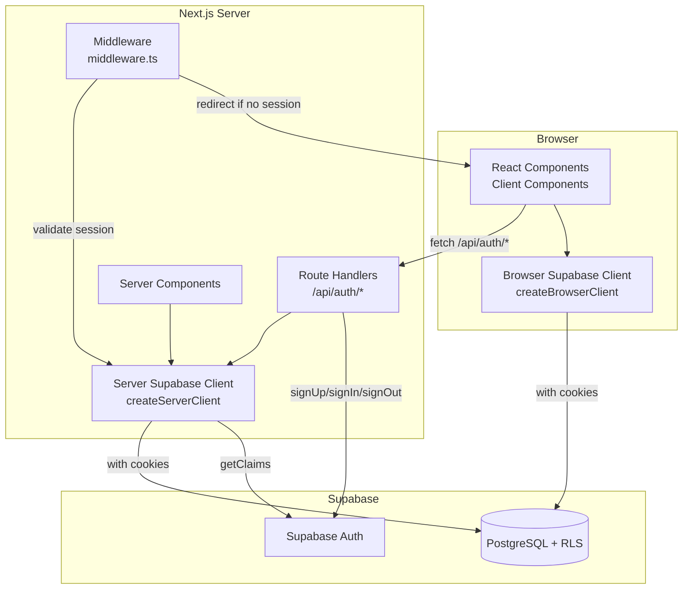
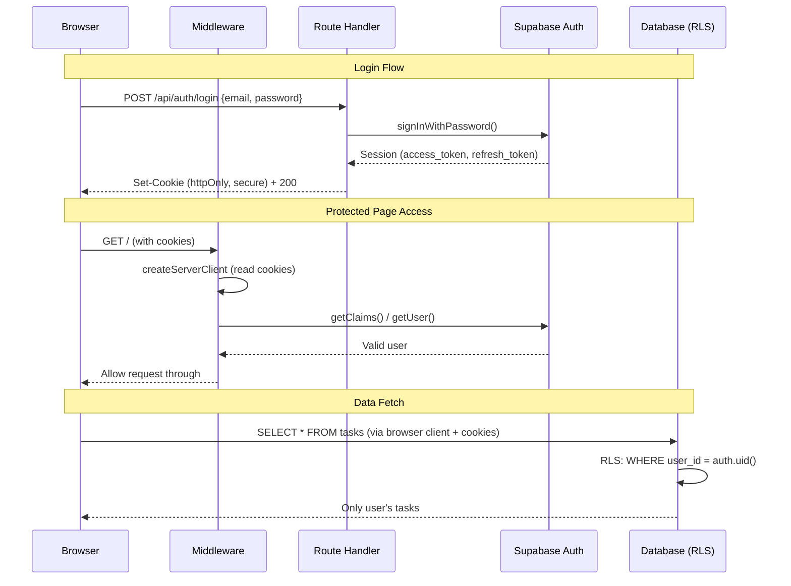

# Design Document: User Authentication

## Overview

This design integrates Supabase Auth into the existing RPG Quest Board application, transforming it from a single-player experience into a multi-user platform. The implementation uses `@supabase/ssr` for cookie-based session management compatible with Next.js 14 App Router, adds Row Level Security (RLS) to isolate user data, and introduces three new pages (register, login, account) styled with the existing pixel/RPG theme.

**Key design decisions:**
- **Server-side auth operations**: All Supabase Auth calls (signUp, signIn, signOut, updateUser) happen exclusively in Next.js Route Handlers, keeping credentials and auth logic off the browser.
- **Cookie-based sessions**: Using `@supabase/ssr` with httpOnly cookies instead of localStorage tokens, reducing XSS attack surface.
- **Middleware-based route protection**: A single `middleware.ts` intercepts requests to protected routes and validates sessions server-side.
- **Incremental migration**: The existing `lib/supabase.ts` proxy is replaced with a `createBrowserClient` wrapper that maintains the same import path for backward compatibility with the service layer.

## Architecture



### Request Flow



## Components and Interfaces

### Supabase Client Utilities

```
lib/supabase/
├── client.ts        # Browser client (createBrowserClient)
├── server.ts        # Server client factory (createServerClient)
└── middleware.ts    # Middleware client factory
```

#### `lib/supabase/client.ts` — Browser Client

```typescript
import { createBrowserClient } from '@supabase/ssr';

export function createClient() {
  return createBrowserClient(
    process.env.NEXT_PUBLIC_SUPABASE_URL!,
    process.env.NEXT_PUBLIC_SUPABASE_ANON_KEY!
  );
}
```

#### `lib/supabase/server.ts` — Server Client Factory

```typescript
import { createServerClient } from '@supabase/ssr';
import { cookies } from 'next/headers';

export async function createClient() {
  const cookieStore = await cookies();

  return createServerClient(
    process.env.NEXT_PUBLIC_SUPABASE_URL!,
    process.env.NEXT_PUBLIC_SUPABASE_ANON_KEY!,
    {
      cookies: {
        getAll() {
          return cookieStore.getAll();
        },
        setAll(cookiesToSet) {
          cookiesToSet.forEach(({ name, value, options }) => {
            cookieStore.set(name, value, options);
          });
        },
      },
    }
  );
}
```

#### `lib/supabase/middleware.ts` — Middleware Client

```typescript
import { createServerClient } from '@supabase/ssr';
import { NextRequest, NextResponse } from 'next/server';

export async function updateSession(request: NextRequest) {
  let supabaseResponse = NextResponse.next({ request });

  const supabase = createServerClient(
    process.env.NEXT_PUBLIC_SUPABASE_URL!,
    process.env.NEXT_PUBLIC_SUPABASE_ANON_KEY!,
    {
      cookies: {
        getAll() {
          return request.cookies.getAll();
        },
        setAll(cookiesToSet) {
          cookiesToSet.forEach(({ name, value }) =>
            request.cookies.set(name, value)
          );
          supabaseResponse = NextResponse.next({ request });
          cookiesToSet.forEach(({ name, value, options }) =>
            supabaseResponse.cookies.set(name, value, options)
          );
        },
      },
    }
  );

  const { data: { user } } = await supabase.auth.getUser();

  return { user, supabaseResponse };
}
```

#### `lib/supabase.ts` — Backward-Compatible Export

The existing `lib/supabase.ts` is refactored to re-export the browser client, maintaining backward compatibility with all service layer imports:

```typescript
import { createClient } from '@/lib/supabase/client';

// Maintain backward compatibility: `import { supabase } from '@/lib/supabase'`
export const supabase = createClient();
```

### Middleware (`middleware.ts`)

```typescript
import { NextRequest, NextResponse } from 'next/server';
import { updateSession } from '@/lib/supabase/middleware';

const PROTECTED_ROUTES = ['/', '/tasks', '/master', '/account'];
const AUTH_ROUTES = ['/login', '/register'];

export async function middleware(request: NextRequest) {
  const { user, supabaseResponse } = await updateSession(request);
  const { pathname } = request.nextUrl;

  const isProtected = PROTECTED_ROUTES.some(
    (route) => pathname === route || pathname.startsWith(route + '/')
  );
  const isAuthRoute = AUTH_ROUTES.includes(pathname);

  // Unauthenticated user on protected route → redirect to login
  if (isProtected && !user) {
    const url = request.nextUrl.clone();
    url.pathname = '/login';
    return NextResponse.redirect(url);
  }

  // Authenticated user on auth route → redirect to dashboard
  if (isAuthRoute && user) {
    const url = request.nextUrl.clone();
    url.pathname = '/';
    return NextResponse.redirect(url);
  }

  return supabaseResponse;
}

export const config = {
  matcher: [
    '/((?!_next/static|_next/image|favicon.ico|.*\\.(?:svg|png|jpg|jpeg|gif|webp)$).*)',
  ],
};
```

### Auth Validation Module (`lib/auth/validation.ts`)

Pure validation functions used by both client-side forms and server-side route handlers:

```typescript
export interface ValidationResult {
  valid: boolean;
  errors: Record<string, string>;
}

export function validateEmail(email: string): string | null {
  if (!email || email.trim().length === 0) return 'Email is required';
  const emailRegex = /^[^\s@]+@[^\s@]+\.[^\s@]+$/;
  if (!emailRegex.test(email.trim())) return 'A valid email address is required';
  return null;
}

export function validatePassword(password: string): string | null {
  if (!password) return 'Password is required';
  if (password.length < 6) return 'Password must be at least 6 characters';
  return null;
}

export function validateConfirmPassword(password: string, confirmPassword: string): string | null {
  if (password !== confirmPassword) return 'Passwords do not match';
  return null;
}

export function validateDisplayName(name: string): string | null {
  if (!name || name.trim().length === 0) return 'Display name is required';
  if (name.trim().length > 50) return 'Display name must be 50 characters or less';
  return null;
}

export function validateRegistrationInput(data: {
  email?: string;
  password?: string;
  confirmPassword?: string;
}): ValidationResult {
  const errors: Record<string, string> = {};
  const emailErr = validateEmail(data.email ?? '');
  if (emailErr) errors.email = emailErr;
  const passErr = validatePassword(data.password ?? '');
  if (passErr) errors.password = passErr;
  if (!errors.password) {
    const confirmErr = validateConfirmPassword(data.password ?? '', data.confirmPassword ?? '');
    if (confirmErr) errors.confirmPassword = confirmErr;
  }
  return { valid: Object.keys(errors).length === 0, errors };
}

export function validateLoginInput(data: {
  email?: string;
  password?: string;
}): ValidationResult {
  const errors: Record<string, string> = {};
  const emailErr = validateEmail(data.email ?? '');
  if (emailErr) errors.email = emailErr;
  if (!data.password) errors.password = 'Password is required';
  return { valid: Object.keys(errors).length === 0, errors };
}
```

### Route Handlers

#### `/api/auth/register/route.ts`

```typescript
import { NextRequest, NextResponse } from 'next/server';
import { createClient } from '@/lib/supabase/server';
import { validateRegistrationInput } from '@/lib/auth/validation';

export async function POST(request: NextRequest) {
  const body = await request.json();
  const validation = validateRegistrationInput(body);

  if (!validation.valid) {
    return NextResponse.json({ errors: validation.errors }, { status: 400 });
  }

  const supabase = await createClient();
  const { data, error } = await supabase.auth.signUp({
    email: body.email.trim(),
    password: body.password,
  });

  if (error) {
    // Generic error to avoid revealing account existence
    return NextResponse.json(
      { error: 'Registration failed. Please try again.' },
      { status: 400 }
    );
  }

  // Initialize Player_Stats for the new user
  if (data.user) {
    await supabase.from('player_stats').insert({
      user_id: data.user.id,
      xp: 0,
      level: 1,
      streak: 0,
      last_completed_date: null,
    });
  }

  return NextResponse.json({ success: true });
}
```

#### `/api/auth/login/route.ts`

```typescript
import { NextRequest, NextResponse } from 'next/server';
import { createClient } from '@/lib/supabase/server';
import { validateLoginInput } from '@/lib/auth/validation';

export async function POST(request: NextRequest) {
  const body = await request.json();
  const validation = validateLoginInput(body);

  if (!validation.valid) {
    return NextResponse.json({ errors: validation.errors }, { status: 400 });
  }

  const supabase = await createClient();
  const { error } = await supabase.auth.signInWithPassword({
    email: body.email.trim(),
    password: body.password,
  });

  if (error) {
    return NextResponse.json(
      { error: 'Invalid credentials. The realm rejects your entry.' },
      { status: 401 }
    );
  }

  return NextResponse.json({ success: true });
}
```

#### `/api/auth/logout/route.ts`

```typescript
import { NextResponse } from 'next/server';
import { createClient } from '@/lib/supabase/server';

export async function POST() {
  const supabase = await createClient();
  await supabase.auth.signOut();
  return NextResponse.json({ success: true });
}
```

#### `/api/auth/profile/route.ts`

```typescript
import { NextRequest, NextResponse } from 'next/server';
import { createClient } from '@/lib/supabase/server';
import { validateDisplayName } from '@/lib/auth/validation';

export async function PATCH(request: NextRequest) {
  const body = await request.json();
  const nameErr = validateDisplayName(body.displayName ?? '');

  if (nameErr) {
    return NextResponse.json({ error: nameErr }, { status: 400 });
  }

  const supabase = await createClient();
  const { error } = await supabase.auth.updateUser({
    data: { display_name: body.displayName.trim() },
  });

  if (error) {
    return NextResponse.json(
      { error: 'Failed to update profile. Please try again.' },
      { status: 500 }
    );
  }

  return NextResponse.json({ success: true });
}
```

### Page Components

#### New Routes

| Route | Component | Auth Required |
|-------|-----------|---------------|
| `/register` | `app/register/page.tsx` | No (redirect if authenticated) |
| `/login` | `app/login/page.tsx` | No (redirect if authenticated) |
| `/account` | `app/account/page.tsx` | Yes |

#### Component Hierarchy

```
app/register/page.tsx
  └── RegisterForm (client component)
        ├── AuthInput (email)
        ├── AuthInput (password)
        ├── AuthInput (confirm password)
        ├── AuthButton ("Begin Adventure")
        └── AuthError (conditional)

app/login/page.tsx
  └── LoginForm (client component)
        ├── AuthInput (email)
        ├── AuthInput (password)
        ├── AuthButton ("Enter")
        └── AuthError (conditional)

app/account/page.tsx
  ├── Sidebar (with "Hero Profile" active)
  └── AccountPanel (client component)
        ├── StatsDisplay (level, XP, streak)
        ├── AuthInput (display name)
        ├── AuthButton ("Save Changes")
        ├── AuthButton ("Log Out" - destructive)
        └── AuthError (conditional)
```

#### Shared Auth UI Components (`components/auth/`)

```
components/auth/
├── AuthInput.tsx       # Styled input with pixel borders, VT323 font
├── AuthButton.tsx      # Gold legendary button with loading state
├── AuthError.tsx       # Red-tinted error container
└── AuthCard.tsx        # Centered card container (max-w-[480px])
```

## Data Models

### Schema Changes

#### `user_id` Column Addition

All existing tables receive a `user_id` column:

```sql
-- Migration: add user_id to all tables
ALTER TABLE tasks ADD COLUMN user_id UUID NOT NULL REFERENCES auth.users(id);
ALTER TABLE player_stats ADD COLUMN user_id UUID NOT NULL UNIQUE REFERENCES auth.users(id);
ALTER TABLE types ADD COLUMN user_id UUID NOT NULL REFERENCES auth.users(id);
ALTER TABLE pics ADD COLUMN user_id UUID NOT NULL REFERENCES auth.users(id);

-- Indexes for RLS performance
CREATE INDEX idx_tasks_user_id ON tasks(user_id);
CREATE INDEX idx_player_stats_user_id ON player_stats(user_id);
CREATE INDEX idx_types_user_id ON types(user_id);
CREATE INDEX idx_pics_user_id ON pics(user_id);
```

#### Row Level Security Policies

```sql
-- Enable RLS on all tables
ALTER TABLE tasks ENABLE ROW LEVEL SECURITY;
ALTER TABLE player_stats ENABLE ROW LEVEL SECURITY;
ALTER TABLE types ENABLE ROW LEVEL SECURITY;
ALTER TABLE pics ENABLE ROW LEVEL SECURITY;

-- Tasks: full CRUD for owner
CREATE POLICY "Users can view own tasks"
  ON tasks FOR SELECT USING (auth.uid() = user_id);
CREATE POLICY "Users can insert own tasks"
  ON tasks FOR INSERT WITH CHECK (auth.uid() = user_id);
CREATE POLICY "Users can update own tasks"
  ON tasks FOR UPDATE USING (auth.uid() = user_id);
CREATE POLICY "Users can delete own tasks"
  ON tasks FOR DELETE USING (auth.uid() = user_id);

-- Player Stats: SELECT and UPDATE for owner
CREATE POLICY "Users can view own stats"
  ON player_stats FOR SELECT USING (auth.uid() = user_id);
CREATE POLICY "Users can update own stats"
  ON player_stats FOR UPDATE USING (auth.uid() = user_id);

-- Types: full CRUD for owner
CREATE POLICY "Users can view own types"
  ON types FOR SELECT USING (auth.uid() = user_id);
CREATE POLICY "Users can insert own types"
  ON types FOR INSERT WITH CHECK (auth.uid() = user_id);
CREATE POLICY "Users can update own types"
  ON types FOR UPDATE USING (auth.uid() = user_id);
CREATE POLICY "Users can delete own types"
  ON types FOR DELETE USING (auth.uid() = user_id);

-- Pics: full CRUD for owner
CREATE POLICY "Users can view own pics"
  ON pics FOR SELECT USING (auth.uid() = user_id);
CREATE POLICY "Users can insert own pics"
  ON pics FOR INSERT WITH CHECK (auth.uid() = user_id);
CREATE POLICY "Users can update own pics"
  ON pics FOR UPDATE USING (auth.uid() = user_id);
CREATE POLICY "Users can delete own pics"
  ON pics FOR DELETE USING (auth.uid() = user_id);
```

#### Default `user_id` on Insert

The service layer sets `user_id` explicitly from the authenticated session. Alternatively, a database default can be used:

```sql
ALTER TABLE tasks ALTER COLUMN user_id SET DEFAULT auth.uid();
ALTER TABLE types ALTER COLUMN user_id SET DEFAULT auth.uid();
ALTER TABLE pics ALTER COLUMN user_id SET DEFAULT auth.uid();
ALTER TABLE player_stats ALTER COLUMN user_id SET DEFAULT auth.uid();
```

### Updated TypeScript Interfaces

```typescript
// Added to lib/types.ts
export interface Task {
  id: string;
  user_id: string;  // NEW
  title: string;
  description: string | null;
  type_id: string | null;
  pic_id: string | null;
  deadline: string | null;
  status: Status;
  priority: Priority;
  parent_task_id: string | null;
  branch_type: BranchType | null;
  branch_order: number | null;
  xp_reward: number;
  created_at: string;
  completed_at: string | null;
}

export interface PlayerStats {
  id: string;
  user_id: string;  // NEW
  xp: number;
  level: number;
  streak: number;
  last_completed_date: string | null;
}

export interface TaskType {
  id: string;
  user_id: string;  // NEW
  name: string;
  icon: string;
  color: string;
  created_at: string;
}

export interface PIC {
  id: string;
  user_id: string;  // NEW
  name: string;
  avatar: string;
  rpg_class: string;
  created_at: string;
}
```

## Correctness Properties

*A property is a characteristic or behavior that should hold true across all valid executions of a system — essentially, a formal statement about what the system should do. Properties serve as the bridge between human-readable specifications and machine-verifiable correctness guarantees.*

### Property 1: Registration input validation rejects all invalid inputs

*For any* registration input where the email does not match a valid email format, OR the password is shorter than 6 characters, OR the password and confirm password fields are not equal, the `validateRegistrationInput` function SHALL return `{ valid: false }` with appropriate error messages, and the input state SHALL remain unchanged.

**Validates: Requirements 1.4, 1.5, 1.6**

### Property 2: Route protection enforces authentication on all protected paths

*For any* request path that matches a protected route (/, /tasks/*, /master/*, /account) and does not include a valid session, the middleware SHALL produce a redirect response to "/login". Conversely, for any request to /login or /register that includes a valid session, the middleware SHALL produce a redirect response to "/".

**Validates: Requirements 4.1, 4.2, 4.4**

### Property 3: User data isolation via RLS

*For any* authenticated user and any table (tasks, player_stats, types, pics), a SELECT query SHALL return only rows where `user_id` matches the authenticated user's ID. No row belonging to a different user SHALL ever be returned.

**Validates: Requirements 5.2, 5.3, 5.4, 5.5**

### Property 4: Automatic user_id assignment on record creation

*For any* valid Task, TaskType, or PIC created by an authenticated user, the resulting database row SHALL have its `user_id` field set to the authenticated user's ID (auth.uid()), regardless of whether the client explicitly provides a user_id value.

**Validates: Requirements 5.6**

### Property 5: Auth route handler input validation

*For any* POST request to /api/auth/register or /api/auth/login with a request body that is missing required fields (email, password) or contains fields that fail validation (invalid email format, empty password), the route handler SHALL return a 400 status code with a JSON body containing error descriptions, without forwarding the request to Supabase Auth.

**Validates: Requirements 8.1, 8.2, 8.7**

### Property 6: Supabase client backward compatibility

*For any* service function that previously imported `supabase` from `@/lib/supabase` and called methods like `.from('table').select()`, the refactored client SHALL maintain the same method signatures and return types, ensuring all existing service layer code continues to function without modification.

**Validates: Requirements 9.5**

## Error Handling

### Client-Side Error Handling

| Scenario | Behavior |
|----------|----------|
| Network failure during auth request | Display "Connection failed. Please check your network and try again." in AuthError component |
| 400 response from route handler | Display field-specific validation errors inline below each input |
| 401 response from login | Display "Invalid credentials. The realm rejects your entry." |
| 500 response from server | Display "Something went wrong. Please try again later." |
| Session expired during navigation | Middleware redirects to /login; no client-side error shown |

### Server-Side Error Handling

| Scenario | Behavior |
|----------|----------|
| Invalid JSON body | Return 400 with "Invalid request body" |
| Missing required fields | Return 400 with field-specific errors |
| Supabase Auth error (signup) | Return 400 with generic "Registration failed" (no account existence leak) |
| Supabase Auth error (login) | Return 401 with generic "Invalid credentials" |
| Supabase Auth error (profile update) | Return 500 with "Failed to update profile" |
| Database error (player_stats init) | Log error server-side; return 500 to client |

### Security Error Handling

- **Token forgery**: Middleware uses `supabase.auth.getUser()` which validates the JWT server-side against Supabase's signing keys. Forged tokens result in redirect to /login.
- **CSRF protection**: Route Handlers only accept POST/PATCH methods. Cookies are set with `SameSite=Lax` by default via @supabase/ssr.
- **Rate limiting**: Supabase Auth has built-in rate limiting for signUp and signIn. No additional application-level rate limiting is implemented in v1.

## Testing Strategy

### Unit Tests (Vitest)

Focus on pure validation logic and component rendering:

- `lib/auth/validation.test.ts` — Test all validation functions with specific examples and edge cases
- `components/auth/*.test.tsx` — Render tests for auth UI components
- `middleware.test.ts` — Test route matching logic with mocked Supabase client

### Property-Based Tests (Vitest + fast-check)

Property-based testing is appropriate for this feature because the auth validation functions are pure functions with clear input/output behavior and a large input space (arbitrary strings for emails, passwords, display names).

**Configuration:**
- Library: `fast-check` (already in devDependencies)
- Runner: `vitest`
- Minimum iterations: 100 per property
- Tag format: `Feature: user-authentication, Property {N}: {description}`

**Properties to implement:**
1. Registration validation rejects invalid inputs (Property 1)
2. Route protection logic (Property 2) — test the path-matching and redirect logic as a pure function
3. Auth route handler validation (Property 5) — test validation layer in isolation

**Note:** Properties 3 and 4 (RLS data isolation, auto user_id) require a live Supabase instance and are better covered by integration tests. Property 6 (backward compatibility) is verified by ensuring existing tests continue to pass after the refactor.

### Integration Tests

- Auth flow end-to-end: register → login → access protected route → logout
- RLS isolation: create data as user A, verify user B cannot access it
- Session refresh: verify token refresh works transparently
- Player_Stats initialization on registration

### Manual Testing Checklist

- [ ] Register with valid credentials → redirected to dashboard
- [ ] Register with existing email → generic error shown
- [ ] Login with valid credentials → redirected to dashboard
- [ ] Login with wrong password → generic error shown
- [ ] Access /account without auth → redirected to /login
- [ ] Update display name → persisted and shown on refresh
- [ ] Log out → redirected to /login, cannot access protected routes
- [ ] RPG theme consistent across all auth pages
- [ ] Scanline overlay visible on auth pages
- [ ] Loading states shown during form submission
