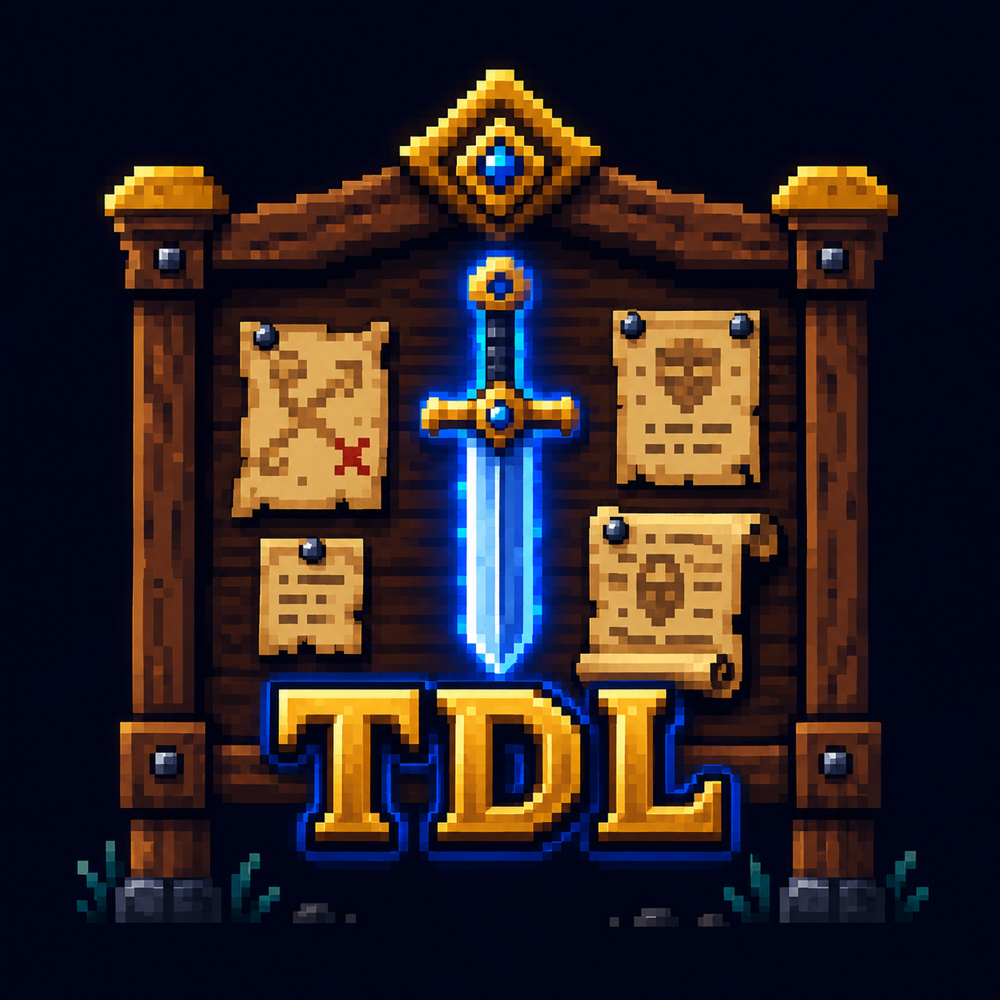

<p align="center">
  
</p>

<h1 align="center">⚔ Quest Board</h1>

<p align="center">
  <strong>A gamified RPG-style task manager that turns your to-do list into an epic adventure.</strong>
</p>

<p align="center">
  
  
  
  
</p>

---

## The Concept

Every task is a **quest**. Every category is a **guild**. Every assignee is a **party member**. Completing work earns **XP**, builds **streaks**, and levels up your hero.

Quest Board wraps a full-featured task management system in a retro pixel-art RPG shell — complete with CRT scanline effects, priority-based glow borders, level-up confetti, and a battle log that tracks your progress like combat moves.

---

## Features

### Quest Management

- **Kanban Board** — Four-column layout: TODO, IN PROGRESS, DONE, OVERDUE
- **Folder View** — Tasks grouped by guild (type) for a different perspective
- **Multi-Step Wizard** — Create quests through a guided 5-step flow: name, guild, deadline, party member, review
- **Subtask Trees** — Nest tasks up to 3 levels deep with sequential or parallel branching
- **Smart Filters** — Filter by status, priority, type, and assignee (combinable with AND logic)
- **Sorting** — By deadline, priority, or creation date

### RPG Progression

- **XP & Leveling** — Earn experience for completing quests. Higher rarity = more XP
- **Priority Tiers** — Normal (gray), Rare (blue), Epic (purple), Legendary (gold) — each with unique glow effects
- **Streak System** — Track consecutive days of quest completion
- **Battle Log** — Record progress on quests with RPG-themed moves: Attack, Dodge, Defense, Use Item, Magic, Rest
- **Level-Up Celebrations** — Pixel confetti and overlay animation when you reach a new level
- **Forfeit Mechanic** — Abandon quests with an XP penalty (atomic transaction with cascade deletion)

### Real-Time & Multi-User

- **Live Updates** — Supabase real-time subscriptions keep everything in sync
- **Authentication** — Email/password auth with "Create Your Hero" and "Enter the Realm" themed pages
- **Row-Level Security** — Every query is scoped to the authenticated user at the database level
- **Overdue Detection** — Automatic status transitions when deadlines pass (60s polling)

### Visual Design

- **Retro Pixel Aesthetic** — Press Start 2P headings, VT323 body text, pixelated rendering
- **CRT Scanline Overlay** — Subtle repeating gradient simulating an old monitor
- **Glow Borders** — Priority-colored box shadows that intensify on hover
- **Dark Theme** — Deep navy backgrounds (`#0d0d1a`) with card surfaces (`#1a1a2e`)
- **Loading Screen** — Random RPG quotes with animated progress bar on login
- **Smooth Animations** — Card flip, XP float, slide-in, bounce, and confetti effects

---

## Tech Stack

| Layer | Technology |
|-------|-----------|
| Framework | Next.js 14 (App Router) |
| Language | TypeScript 5 (strict mode) |
| Database | Supabase (PostgreSQL + Auth + Realtime) |
| Styling | Tailwind CSS 3 with custom RPG tokens |
| Testing | Vitest + fast-check (property-based) |
| Fonts | Press Start 2P, VT323 (via `next/font`) |

---

## Getting Started

### Prerequisites

- Node.js 18+
- A [Supabase](https://supabase.com) project

### Installation

```bash
git clone https://github.com/your-username/quest-board.git
cd quest-board
npm install
```

### Environment Setup

Create a `.env.local` file:

```env
NEXT_PUBLIC_SUPABASE_URL=your_supabase_project_url
NEXT_PUBLIC_SUPABASE_ANON_KEY=your_supabase_anon_key
```

### Database Migrations

Run the SQL migrations in `supabase/migrations/` against your Supabase project (in order):

```
001_initial_schema.sql
002_add_subtasks.sql
003_add_user_auth.sql
004_battle_log.sql
005_forfeit_quest.sql
```

### Development

```bash
npm run dev
```

Open [http://localhost:3000](http://localhost:3000) — register a hero and start questing.

---

## Project Structure

```
app/                    → Pages and API routes (App Router)
├── page.tsx            → Dashboard (quest board)
├── tasks/[id]/         → Quest detail + battle log
├── master/types/       → Guild management
├── master/pics/        → Party member management
├── login/              → "Enter the Realm"
├── register/           → "Create Your Hero"
└── account/            → Hero profile

components/             → 23 reusable React components
├── KanbanBoard.tsx     → Four-column status board
├── FolderView.tsx      → Grouped by type
├── QuestCard.tsx       → Task card with glow borders
├── WizardModal.tsx     → 5-step quest creation
├── BattleLog.tsx       → RPG activity feed
├── Sidebar.tsx         → Player stats + navigation
└── LevelUpOverlay.tsx  → Confetti celebration

lib/                    → Shared logic
├── services/           → Data access layer (Supabase queries)
├── types.ts            → Domain types and constants
├── xp.ts              → XP calculation
├── streak.ts          → Streak logic
└── filters.ts         → Task filtering/sorting
```

---

## Scripts

| Command | Description |
|---------|-------------|
| `npm run dev` | Start development server |
| `npm run build` | Production build |
| `npm run lint` | ESLint (next/core-web-vitals) |
| `npm run test` | Run tests once |
| `npm run test:watch` | Run tests in watch mode |

---

## Security

- OWASP-aligned security headers (CSP, HSTS, X-Frame-Options)
- Supabase RLS on all tables — data isolation at the database level
- Input validation and string capping on all user inputs
- Session-based auth with middleware route protection
- No secrets in client bundles

See [SECURITY.md](SECURITY.md) for the full security posture.

---

## RPG Mechanics Reference

| Rarity | Base XP | Glow Color |
|--------|---------|------------|
| Normal | 10 XP | Gray `#6b7280` |
| Rare | 25 XP | Blue `#4a9eff` |
| Epic | 50 XP | Purple `#a78bfa` |
| Legendary | 100 XP | Gold `#f0c040` |

**Battle Log Moves:** Each move logged on a quest adds +5 pending XP, awarded on completion.

**Streaks:** Complete at least one quest per day to maintain your streak counter.

**Forfeit:** Abandoning a quest costs an XP penalty proportional to its reward.

---

## License

MIT

---

<p align="center">
  <em>"Legends aren't born — they're checked off a to-do list."</em>
</p>
